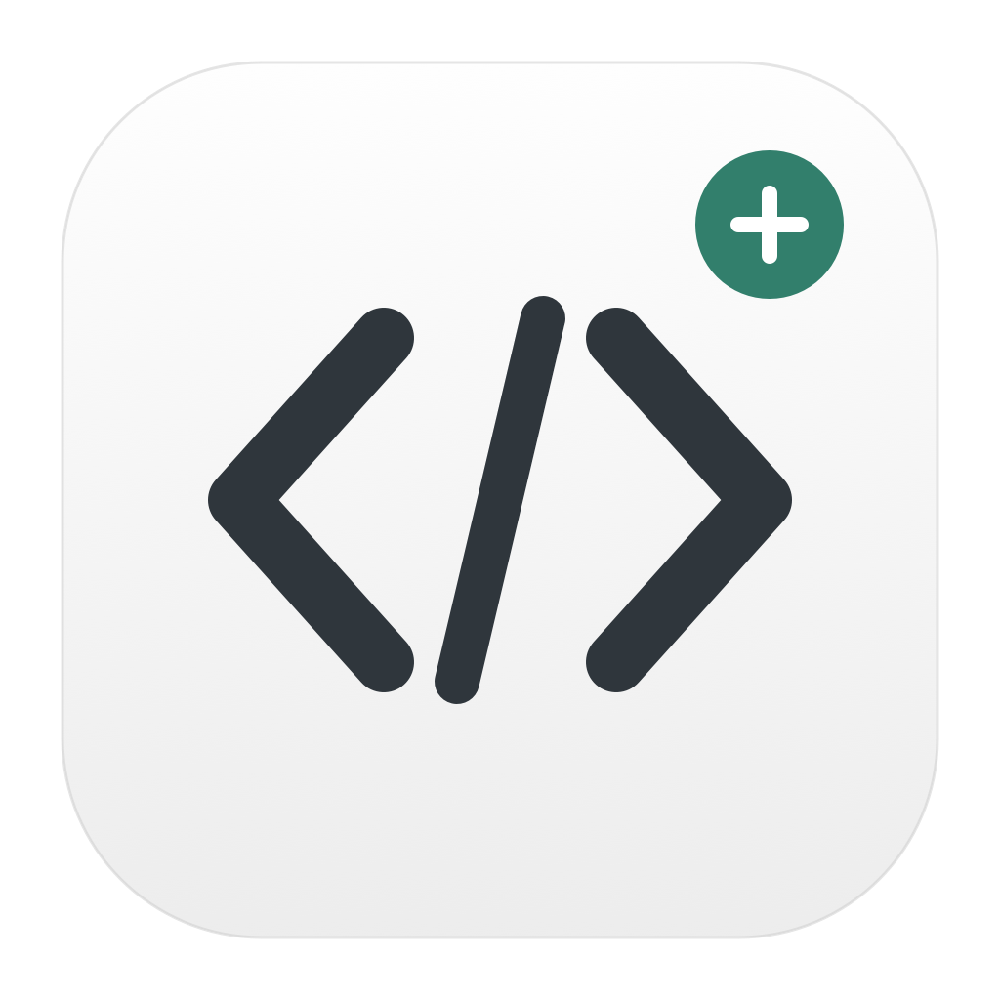
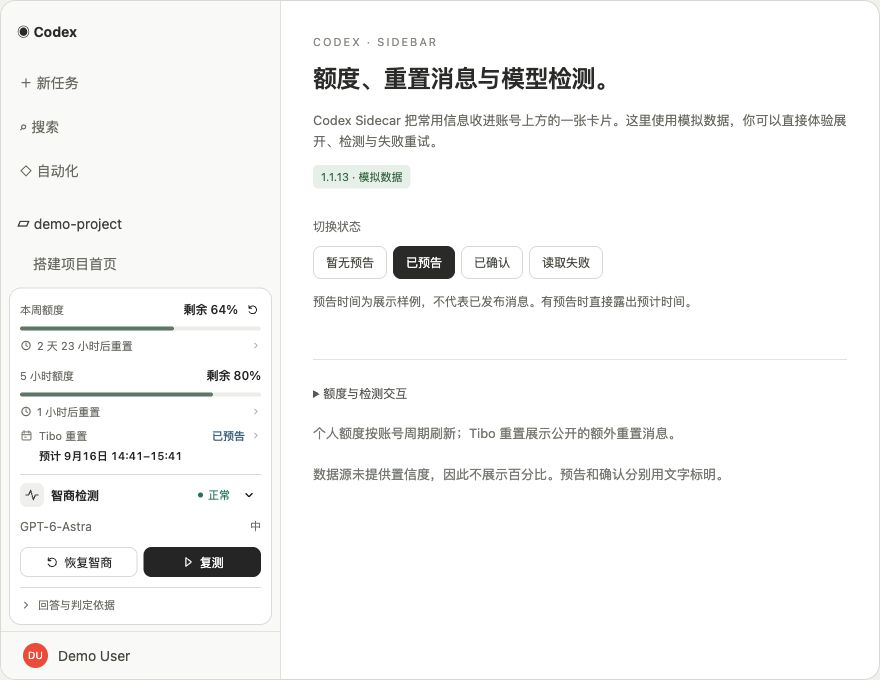
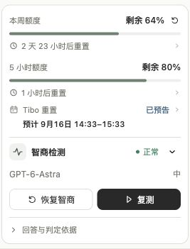
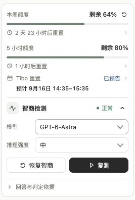

<p align="center"></p>

<h1 align="center">Codex Sidecar</h1>

<p align="center">在 Codex 侧栏，看额度、看重置、测模型。</p>
<p align="center"><strong>简体中文</strong> · <a href="README.en.md">English</a></p>

**把剩余额度、重置消息和模型检测，收进账号上方的一张折叠卡片。** Codex Sidecar 是 macOS 上的社区增强工具，双击「CodeX 注入版」即可启动 Codex 并加载卡片，无需常驻终端或额外 API Key。

## 产品截图



卡片位于 **Codex 侧栏底部、账号菜单上方**。上图为设计预览，账号、项目、额度、模型回答和重置预告均使用演示数据。

<details>
<summary>查看卡片细节</summary>

| 日常查看 | 展开设置 |
| :---: | :---: |
|  |  |

</details>

- **看额度**：周额度与 5 小时额度的剩余比例、重置倒计时和准确北京时间。
- **看重置**：展示 AIHOT 提供的 Tibo 额外重置预告、确认状态和来源；仅展示，不执行重置。
- **测模型**：选择模型与推理强度，执行固定知识题或「恢复智商」实验；独立任务完成后自动归档，失败可继续收尾。

## 快速开始

需要 **macOS、已登录的 Codex、Node.js 22+、Git 和 Xcode Command Line Tools**。缺少命令行工具时，先运行 `xcode-select --install`。无需 `npm install`。

```sh
git clone https://github.com/Wan-Kai/codex-sidecar.git
cd codex-sidecar
npm run build:launcher
```

构建会生成本机 App 和桌面替身。首次使用先用 **⌘Q 完全退出 Codex**，再双击桌面的 **CodeX 注入版**。以后使用这个入口或将 App 放入 Dock；原始 Codex 图标不会自动加载卡片。

请保留仓库位置。移动仓库或更换 Node 路径后需重新构建，生成的 App 不能单独复制给他人。[自定义安装位置与故障处理 →](docs/guide.zh-CN.md)

## 使用须知

- **检测是知识题实验**：明确回答 Gemini 主版本 ≥ 3 判为正常，≤ 2 判为异常，含糊回答显示无法判定；这不构成智力测量。「恢复智商」按钮没有经过能力恢复验证。模型请求消耗正常额度。[完整规则 →](docs/guide.zh-CN.md#检测规则先知道它在测什么)
- **兼容性依赖宿主**：项目通过本机 CDP 加载界面，不修改 Codex 安装包。已验收的宿主为 `26.908.40834`；其他版本可能需要适配。项目与 OpenAI 无隶属关系。
- **数据留在各自链路**：额度使用 Codex 当前会话；Tibo 消息匿名读取 AIHOT，不附带账号信息。调试端口 `9222` 应保持仅本机可用。[数据与运行边界 →](docs/guide.zh-CN.md#数据与运行边界)

## 更新与停用

更新后重新打开入口即可：

```sh
git pull --ff-only
npm run build:launcher
```

停用前先完成卡片中的任务收尾，运行 `npm stop`，再退出 Codex 并从原始图标打开。[卸载、预览与开发检查 →](docs/guide.zh-CN.md)

[使用指南](docs/guide.zh-CN.md) · [架构说明](docs/architecture.md) · [反馈问题](https://github.com/Wan-Kai/codex-sidecar/issues) · [MIT License](LICENSE)
