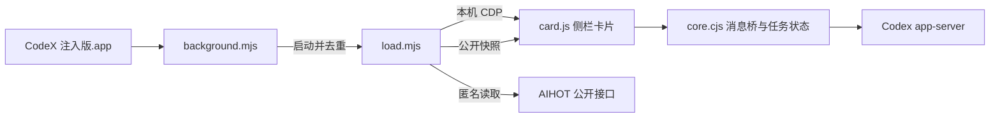

# 架构与开发说明

Sidecar 复用 Codex 自身的模型请求链路。运行时只有一个外置 Node 加载器与注入页面的卡片，没有独立 HTTP 后端或账号服务。



## 模块职责

| 文件 | 负责 | 不负责 |
| --- | --- | --- |
| `background.mjs` | 核对应用 bundle ID、启动应用、加载器进程去重、版本替换、日志 | 模型请求与界面状态 |
| `load.mjs` | 验证本机 CDP 目标、挂载与更新卡片、传递公开快照 | 新建模型任务、管理账号 |
| `card.js` | Shadow DOM 界面、模型选项、账号切换和额度刷新、侧栏挂载 | 直接管理任务持久化 |
| `core.cjs` | 固定提示、版本识别、原生消息桥、Runner、额度归一化 | 进程管理与第三方数据请求 |
| `tibo.cjs` | 公共重置数据白名单、状态推导、请求合并和退避 | 推断个人额度到账、兑换重置券 |
| `build-launcher.mjs` / `build-shortcut.swift` | 本机 App 编译、图标、原生桌面替身 | 修改 Codex 应用包 |

## 一次模型请求

1. 点击检测或恢复时冻结当前模型与推理强度。
2. Runner 获取同一页面源的 Web Lock，在锁内重读共享等待记录。另一个窗口已有任务时阻止重复发送。
3. 用 `thread/start` 创建独立任务，再用 `turn/start` 发送原样提示；不提供项目环境，使用只读权限。
4. 持续读取 `thread/read`，收齐最终回答，检查工具项并按本地规则分类。
5. 任务终态后调用 `thread/archive`；归档成功清除等待记录，失败保留结果供重试。

请求等待超过三分钟或连接异常时保留原任务。重试收尾只读取和归档已有任务；不重新发送提示。创建阶段没有拿到任务 ID 时显示不确定状态，避免假定创建失败后重复发问。

所有会修改等待记录的入口共用 Web Lock，并核对任务身份。任务账号归属只保存在发起页面内存；重载、切换账号、其他窗口接手后可收尾，但不能把不确定归属的结果展示为当前检测结果。页面锁或持久化读取不可用时阻止新请求。

## 数据刷新

额度通过 `account/rateLimits/read` 读取，仅选择 Codex 通用额度，按实际窗口时长标记周或 5 小时。缺失值保留未知，不替换为零。可见页面每分钟刷新；账号切换立即清空并作废旧响应。

AIHOT 请求放在已有加载器中，因为宿主 CSP 不允许页面连接该第三方域名。每五分钟获取完整快照，支持 ETag、短时去重、退避与 Retry-After。传入页面前只保留展示所需字段，原帖链接只接受指定来源。第三方请求故障不阻塞卡片与模型任务。

页面超过 45 秒未收到加载器快照时使用独立的 `syncing` 展示状态，主行显示「进行中」，详情明确为等待后台同步。该状态不表示接口读取失败或重置正在执行；收到新快照后恢复消息状态。

额外重置的「预告」「已确认」「待确认」来自不同证据；预告到期不能自动转换为成功。核验超过十五分钟提示消息待更新。数据不提供置信度时不自行计算可信率。

## 生命周期与安装

App 在构建时记录 Node、脚本路径及可选的 `CODEX_APP_PATH`，通过 AppleScript 后台执行。Node 使用独立进程会话与日志重定向，因此终端关闭不影响加载器。

启动锁串行化加载器创建，PID、唯一标记和路径共同确认归属；同版本复用，新版本停止旧进程再启动。不强制退出 Codex。加载器首次连接等待约 45 秒，已连接后失联宽限约 15 秒，正在进行的 CDP 调用可能使实际退出更晚。

加载器只匹配已知的 `app://-/index.html` 或 Codex / ChatGPT 命名应用内的 `webview/index.html`，随后确认宿主消息桥。改名应用在使用 `file:` 页面时可能不匹配，需要针对真实宿主验证，不能靠放宽到任意页面解决。

桌面使用 Finder 原生替身加独立自定义图标。构建先检查旧入口归属、暂存新替身并验证解析目标，再原子替换。原生替身更新不修改已签名的 App。`--no-shortcut` 跳过桌面生成，供 CI 和开发构建使用。

## 最小检查

```sh
node --test test/core.test.cjs
node --test test/runner-state.test.cjs test/card-state.test.cjs
node --test test/usage.test.cjs test/tibo.test.cjs
node --test test/background.test.mjs test/app-path.test.mjs test/loader.test.mjs
node --check card.js
zsh -n Start.command Stop.command
```

完整的 macOS 检查顺序为 `npm run build:check` → `npm test` → `npm run test:launcher`，CI 使用相同入口。原生图标读取检查不能单独证明 Finder 桌面的实际显示正常；修改替身或图标后还应目视检查桌面。

重新生成图标：

```sh
swift build-icon.swift "$PWD/assets"
iconutil -c icns -o assets/CodeXInjected.icns assets/CodeXInjected.iconset
npm run build:check
```

`preview.html` 用模拟消息桥驱动正式卡片；界面验收可切换状态，不调用真实账号或模型。自动测试与预览不能代替新宿主版本的端到端兼容性验收。
